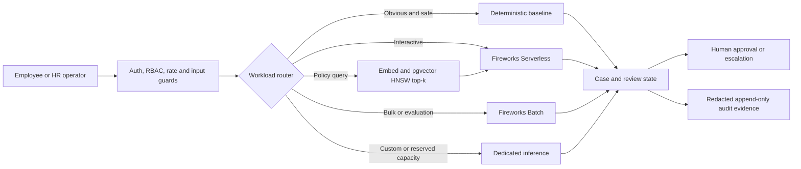

# AMD Hackathon Strategy: HR AI Command Center

## Position

HR AI Command Center is an open-source, audit-first control plane for HR
workflows. It combines policy-grounded agents, deterministic fallbacks, human
approval, and portable acceleration.

The defensible competitive wedge is:

1. **Governed workflows, not an unbounded chatbot.**
2. **Useful at zero model spend, accelerated when a provider or GPU is present.**
3. **Portable across CPU, Fireworks, and self-hosted AMD ROCm paths.**
4. **Evidence-producing controls: cases, citations, overrides, audit export, and
   bias gates.**

For the **Best AMD-Hosted Gemma Project** track, use
[HACKATHON_GEMMA_AMD_DEPLOYMENT.md](./HACKATHON_GEMMA_AMD_DEPLOYMENT.md) as the
operator runbook. The short version: Fireworks authentication is the hosted
API/BYOK proof; the judged AMD path is `LLM_PROVIDER=amd_vllm` with a
Gemma-family served model running behind the OpenAI-compatible vLLM endpoint.
The scan-friendly submission keywords are **AMD powered**, **Gemma powered** /
**Gamma powered**, and **Fireworks powered**; use “Gemma” for official technical
claims and keep “Gamma” only as a keyword alias when needed.

Do not claim that competitors violate law, that this product is legally
compliant, or that no comparable open-source project exists without a sourced,
current review. The product is advisory software and still requires deployment-
specific legal, security, privacy, and model-risk assessment.

## Thesis and academic argument

The senior-engineer thesis is:

> Enterprise agentic AI fails when model calls are treated as magic instead of
> governed infrastructure. HR AI Command Center is a cost-bounded A2A control
> plane: route cheaply, retrieve narrowly, constrain outputs, certify handoffs,
> and keep humans in the loop for sensitive outcomes.

That matters more than a larger prompt window or a single impressive chatbot
demo. The project is designed around four engineering principles that map to
well-known research and production patterns:

| Principle | Product expression | Evidence path |
|---|---|---|
| **Constrained generation** | Fireworks/OpenAI-compatible `json_schema`, Pydantic contracts, and `FireworksOutputCertifier` validate agent outputs before another agent consumes them. | Schema tests, certification telemetry, A2A envelope metadata |
| **Cascade routing** | Deterministic fast paths and the smallest allowlisted capable model handle simple work; higher-cost routes are reserved for ambiguous or high-risk synthesis. | `CostRouter`, zero-spend benchmark, route metadata in envelopes |
| **Retrieval before context stuffing** | Policies are chunked and retrieved from pgvector HNSW; chat threads carry evidence pointers and summaries instead of full PDFs. | RAG round-trip tests, citation guardrails, policy version metadata |
| **Human-governed automation** | Onboarding, approvals, attrition, and adverse-impact-sensitive flows pause for manager or HR review. | Case state, audit rows, approval tests, dashboard evidence |

The hackathon story is therefore not "we built an inference engine." It is:

1. **Control plane:** the application controls spend, routing, and auditability
   before a provider call can happen.
2. **Fireworks plane:** live structured inference, prompt-cache locality, vision
   and Batch are used only when a key and model allowlist are explicitly present.
3. **AMD-hosted Gemma plane:** the same workflow can switch to
   `LLM_PROVIDER=amd_vllm` and a Gemma-family model served behind an
   OpenAI-compatible ROCm/vLLM endpoint for the judged AMD path.

This lets the demo satisfy both realities in the pasted plan: do not burn the
hackathon debugging GPU plumbing when Fireworks proves the product workflow, but
keep a real AMD/Gemma deployment profile so the hosted-hardware claim is
evidence-gated rather than hand-waved.

## Claim ledger

| Claim | Status | Evidence required before pitching |
|---|---|---|
| Deterministic mode works without keys | Implemented | Full pytest suite and demo workflow |
| Every agent action reaches audit/case controls | Implemented for shipped flows | Agent contract and pipeline tests |
| Fireworks online inference is allowlisted | Implemented | Factory/static guard tests |
| Fireworks structured resume request | Implemented building block | JSON-schema and vision request tests |
| Fireworks Batch preparation, submit, status | Implemented; live run credential-gated | Mock transport tests plus one live job ID |
| pgvector HNSW policy retrieval | Implemented | Postgres round-trip test |
| AMD Triton vector scoring | Implemented, disabled by gate | CPU oracle; named ROCm benchmark still required |
| hipVS acceleration | Experiment target, not integrated | ROCm host, hipVS install, recall/latency comparison |
| 10x vector speedup | Unproven | Same-corpus CPU/AMD benchmark JSON |
| 5x resume throughput | Unproven | Completed Batch job and sequential baseline |
| 10,000 concurrent users | Unproven target | Distributed load test and autoscaling evidence |
| EU AI Act ready | Do not claim | Legal assessment and required technical evidence |

The current European Commission timeline says employment-related high-risk rules
are expected to apply from **2 December 2027**, following the 2026 political
agreement. Treat the timeline as legally volatile and re-check it before a
presentation: [European Commission AI Act overview](https://digital-strategy.ec.europa.eu/en/policies/regulatory-framework-ai).

## Product data flow



## Sampling policy

Fireworks supports `temperature`, `top_k`, and `top_p`, but its API guidance
generally recommends changing temperature **or** top-p rather than blindly
tuning both. Structured outputs constrain format; sampling does not replace JSON
Schema.

| Role | Temperature envelope | Top-k | Top-p | Reason |
|---|---:|---:|---:|---|
| Policy RAG | `0.0` | `1` | omitted | Greedy, citation-grounded synthesis |
| Case triage | `0.0` | `1` | omitted | Repeatable classification |
| Skill validation | `0.0` | `1` | omitted | Repeatable evidence check |
| Resume VLM extraction | `0.0` | `20` | omitted | Schema-constrained extraction |
| Attrition explanation | `0.0-0.1` | `20` | omitted | Stable narrative over local model output |
| HR chat | `0.0-0.3` | `50` | omitted | Limited conversational variation |

These values are reviewed defaults, not universal optimums. Promote changes only
after schema validity, groundedness, safety, p95 latency, and cost improve on the
same golden set. The executable policy is in
`backend/core/genai_lifecycle.py`.

## Dynamic routing

The router follows a cost-before-complexity rule:

1. **Tier 0:** urgent keyword signals or one unambiguous category with at least
   two matched terms skip the LLM.
2. **Tier 1:** ambiguous triage and ordinary chat use the smallest allowlisted
   role-appropriate model.
3. **Tier 2:** policy synthesis, resume extraction, and nuanced review use the
   largest allowlisted role-appropriate model.
4. **Tier 3:** asynchronous resume sets and evaluations use Fireworks Batch.
5. **Dedicated:** only custom/fine-tuned models or measured reserved-capacity
   requirements.

Do not claim a percentage of traffic routed to a tier until production telemetry
measures it.

## Five demo use cases

### 1. Policy compliance checker

1. Upload a sample handbook.
2. Ask a remote-work question.
3. Show retrieved citations, answer confidence, policy version, and audit row.
4. Ask an unsupported question and show human escalation instead of invention.

### 2. Demographically blinded resume screen

1. Upload a resume and paste a job description.
2. Show protected-field blinding before scoring.
3. Show matched/missing skills, consistency flags, score method, and recruiter
   review state.
4. For a scanned PDF, explain that Fireworks VLM page extraction is available
   only when configured; never imply that a text-only parser read an image.

### 3. Attrition advisory

1. Enter six job-related numeric signals.
2. Show the local RandomForest score and ranked factor contributions.
3. Show that the LLM is optional and only explains the local model result.
4. Emphasize that the result cannot trigger an adverse employment action.

### 4. Automated case triage

1. Submit an obvious urgent ticket and show the zero-spend fast route.
2. Submit an ambiguous ticket and show live-model routing when configured.
3. Show POLICY retrieval and URGENT human escalation.
4. Open the case dossier and audit record.

### 5. Onboarding orchestration

1. Start a new-hire workflow.
2. Show account/training task stages.
3. Pause at the approval checkpoint.
4. Approve or reject and show the resulting event and audit state.

## Fireworks Batch demo

Prepare data without a key:

```bash
cd backend
export ALLOWED_MODELS=tenant/approved-model
python -m scripts.fireworks_prepare_batch samples.json resumes.jsonl \
  --model tenant/approved-model
```

Submit only from an approved environment:

```bash
export FIREWORKS_API_KEY=...
export FIREWORKS_CONTROL_BASE_URL=...
export FIREWORKS_ACCOUNT_ID=...

python -m scripts.fireworks_batch_job submit resumes.jsonl \
  --job-id resume-demo-001 \
  --model tenant/approved-model \
  --input-dataset resume-demo-input \
  --output-dataset resume-demo-output \
  --top-k 20

python -m scripts.fireworks_batch_job status --job-id resume-demo-001
python -m scripts.fireworks_batch_job watch --job-id resume-demo-001 \
  --interval 10 --max-polls 60
```

Batch inference is billed at a discount relative to standard Serverless and
uses prompt caching, but model compatibility must be verified before submission:
[Fireworks Batch documentation](https://docs.fireworks.ai/guides/batch-inference).

## AMD acceleration path

### Current

- Kubernetes inference pods request `amd.com/gpu` and select AMD Instinct nodes.
- Triton kernels autotune 256-2048 element tiles, 4/8 logical warps, and
  multi-row grid mappings.
- Kernels are off by default until correctness, corpus size, and measured speedup
  gates pass.
- pgvector HNSW is the production retrieval baseline.

### hipVS experiment

hipVS provides ROCm-native HNSW, CAGRA, IVF-PQ, and brute-force search. It is a
promising experiment, not a drop-in production replacement. Multi-GPU and
multi-node functionality is currently documented as experimental.

Experiment gate:

1. Run on a named supported AMD GPU and pinned ROCm/hipVS versions.
2. Use the same vectors, queries, distance metric, and top-k as pgvector.
3. Measure recall@k before latency.
4. Record index build time, p50/p95 query latency, throughput, and GPU memory.
5. Integrate only if end-to-end RAG improves and tenant filtering/updates remain
   correct.

References:

- [AMD hipVS overview](https://rocm.docs.amd.com/projects/hipVS/en/latest/)
- [AMD hipVS examples](https://rocm.docs.amd.com/projects/hipVS/en/docs-25.10/how-to/using-hipVS.html)

Do not add `AMD_WAVEFRONT_OPTIMIZED=true` as a marketing-only flag. AMD Instinct
targets documented by hipVS use wavefront size 64, but the proof must be kernel
metadata and benchmark output, not a boolean.

## Benchmark commands

Deterministic fallback:

```bash
cd backend
python -m benchmarks.benchmark_fallback \
  --iterations 10000 --output fallback-local.json
```

Current local evidence from 10,000 iterations on Darwin arm64 / Python 3.12.3
(CPU only, no network):

| Operation | Median | p95 |
|---|---:|---:|
| Keyword triage | 0.000792 ms | 0.000834 ms |
| Hash embedding | 0.030500 ms | 0.034000 ms |

These microbenchmarks prove the fallback operations are cheap on that machine;
they do **not** prove HTTP response latency or an advantage over Fireworks/ROCm.

Triton kernel matrix on an AMD GPU:

```bash
python -m benchmarks.benchmark_kernels \
  --matrix --max-gpu-memory-mb 2048 \
  --output benchmark-mi300x.json
```

Hackathon environment preflights:

```bash
python scripts/collect_hackathon_evidence.py --profile static
cd backend
python -m scripts.verify_hackathon_env --mode fireworks-auth
python -m scripts.verify_hackathon_env --mode amd-gemma
cd ..
python scripts/verify_amd_gemma_overlay.py
```

Load test:

```bash
locust -f tests/load/locustfile.py --host http://localhost:8000 \
  --users 50 --spawn-rate 5 --run-time 2m --headless
```

Scale to 1,000 users only after the 50-user test passes and the environment has a
real queue, shared rate limiter, Redis WebSocket fan-out, Postgres capacity, and
an explicit model quota. A laptop test cannot prove Kubernetes-scale capacity.

## Judge-facing metrics

| Metric | Current evidence | Promotion target |
|---|---|---|
| Deterministic triage latency | Run fallback benchmark | p95 below API budget |
| pgvector retrieval | Local Docker load + poisoned-policy round trip passed; no latency claim | p95 <100 ms on named dataset |
| Full policy chat | Deterministic grounded excerpt passed; live-provider latency pending | p95 <3 s with provider quota stated |
| Resume extraction quality | Golden dataset pending | Field F1 and missing-field threshold |
| Resume bias | CI disparity-ratio gate | <1.1 on documented synthetic test |
| Fireworks Batch savings | Provider pricing, no local live job yet | Actual billed input/output comparison |
| AMD vector speedup | No named-hardware result | Measured speedup with recall parity |
| Concurrent users | 50-user harness exists | Increase only after each gate passes |

## Five-day execution

### Day 1: reproducibility

- Run CPU fallback and pgvector baselines.
- Validate Docker/Compose and Kubernetes manifests.
- Provision a named ROCm host; record `rocminfo`, driver, GPU, and memory.

### Day 2: complete user flows

- Run policy, triage, resume, attrition, and onboarding demos end to end.
- Verify redaction before provider calls and audit after each action.
- Produce one valid Fireworks structured extraction.

### Day 3: evidence

- Run sampling evaluation over a fixed golden set.
- Execute bias and prompt-injection gates.
- Run 50-user load test with RAG on/off.

### Day 4: acceleration

- Run Fireworks Batch on a small resume set.
- Run Triton matrix on AMD hardware.
- If time remains, run the isolated hipVS experiment.

### Day 5: package the proof

- Publish benchmark JSON, load-test CSV, screenshots, model cards, and known
  limitations.
- Record the five-use-case demo.
- Use only claims backed by the evidence package.

## Win statement

> HR AI Command Center does not use an LLM for every decision. It routes simple
> work to transparent local baselines, grounds policy answers in owned documents,
> uses Fireworks for accelerated structured and Batch inference, and keeps an
> optional AMD ROCm path behind correctness and performance gates. Every sensitive
> result remains reviewable, auditable, and reversible.
