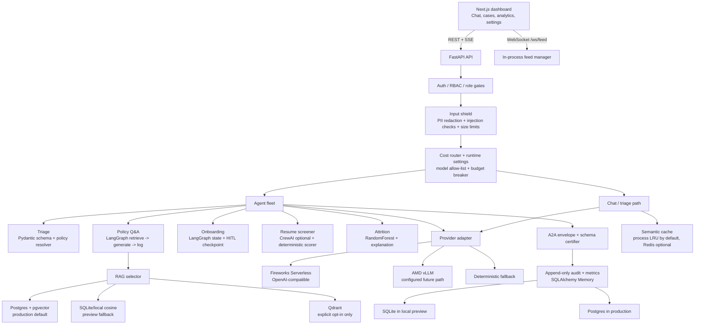

# HR AI Command Center
## Current Architecture Playbook

This is the implementation map for the repository as it runs today. It is
deliberately evidence-labelled: a contract, a local test, and a live provider
call are different kinds of proof.

## 1. Runtime Topology



### Request path

```text
browser
  -> FastAPI route
  -> auth/RBAC
  -> normalize + redact + prompt-injection signal
  -> cost tier / model allow-list / budget preflight
  -> agent or deterministic fallback
  -> RAG/tools/provider if permitted
  -> schema + PII + grounding certification
  -> audit, cost attribution, metrics
  -> SSE/REST response and WebSocket event when applicable
```

The orchestrator in `backend/agents/orchestrator.py` is a planning and
certification layer. `orchestrate()` does not call Fireworks, Docker, Git, or
other tools. It selects an A2A card, creates a dispatch contract, and returns a
certified envelope with `provider_call=false`. Execution remains in the agent
and route paths.

## 2. Component Truth Table

| Component | Current implementation | Evidence level | Boundary |
|---|---|---|---|
| FastAPI API | Routes for chat, agents, cases, audit, lifecycle, settings, metrics, WebSocket feed | Tested local; live preview exercised | Single-process feed manager; multi-worker fan-out is future work |
| Next.js dashboard | Chat, Fleet, Cases, Analytics, Audit, Settings, approvals, role UI | Build/lint clean; browser exercised | UI telemetry is not provider billing |
| A2A orchestrator | Cards, alias routing, allow-list model selection, certified handoff | Unit/API tests | Plans only; no autonomous tool execution |
| Policy Q&A | LangGraph graph plus service RAG fallback | Tests; live Fireworks chat verified | Current preview may use local SQLite cosine retrieval |
| Onboarding | LangGraph state machine with pause/review behavior | Tests | Real account/email integrations are not connected |
| Resume screener | CrewAI crew when available; deterministic semantic/keyword scorer otherwise | Tests; live VLM/batch is credential-gated | Keyword fallback cannot prove negation/context; UI marks fallback mode |
| Triage | Typed classification, urgent escalation, policy resolver | Tests | No separate production CrewAI crew is required by the current path |
| Attrition | RandomForest over six numeric features plus disengagement interaction | Tests and deterministic scoring | Not a validated employment decision model; human review required |
| RAG storage | pgvector on Postgres; local SQLite fallback; Qdrant explicit | Backend contract/integration tests | Qdrant is not the production default |
| Shared memory | Async SQLAlchemy Memory | SQLite local; Postgres production path | Redis is optional cache only, not required shared memory |
| Fireworks Serverless | OpenAI-compatible provider, structured outputs, streaming, cost metadata | Live chat call verified | Account billing balance is not exposed by this app |
| Fireworks Batch | JSONL preparation, submit/status normalization, durable metadata | Mock/contract tests | No provider batch job is selected in the current demo; a returned `Pending` state is not completion evidence |
| AMD vLLM | Provider factory, smoke scripts, capability gate | Configured path only | No live ROCm/vLLM hardware evidence in this run |
| CrewAI | Optional resume/adapter integration | Contract tests | Production image intentionally omits heavy CrewAI dependency |
| LangSmith | Optional trace/cost bridge | Code path + fallback tests | Not active unless tracing flags and key are injected |
| Gmail agent | Not present | No evidence | Do not show it as part of the current architecture |
| MinIO | Compose service and ETL/integration fixtures | Local integration contracts | Not the source of truth for policy/audit storage |

## 3. Agent Playbooks

### Policy Q&A: grounded answer

```text
question
  -> sanitize and cap input
  -> retrieve top-k policy chunks
  -> active-version filter + title/section boosts
  -> cache lookup by normalized query + context hash
  -> Fireworks structured synthesis, or deterministic grounded fallback
  -> citation/source check + confidence + PII/schema certification
  -> audit and response
```

Human review triggers: no sources, low grounding confidence, or conflicting
policy versions. The answer must remain grounded; retrieval failure is not a
license to invent policy.

### Triage: route a ticket

```text
ticket
  -> typed classification
  -> URGENT ----------------------------> human escalation + case update
  -> POLICY -> retrieve -> grounded answer -> resolve or review
  -> ONBOARDING ------------------------> onboarding state machine
  -> other category --------------------> assigned queue + audit
  -> human override --------------------> preserve machine label + override event
```

The machine label and human override are kept separately for drift analysis.

### Onboarding: state-changing workflow

```text
new-hire data
  -> validate
  -> create accounts
  -> assign training
  -> PAUSE / emit HITL event
  -> approve -> send welcome email -> notify manager
  -> reject/failure -> pause + audit + human review
```

The current implementation proves state progression and pausing. It does not
prove that a real identity provider, email provider, or HRIS has been connected.

### Resume screening: interactive versus batch

```text
JD + resume
  -> extract required skills
  -> embedding/keyword comparison
  -> optional CrewAI narrative review
  -> context validation when a key is available
  -> score + recommendation + matched/missing/unverified skills
  -> recruiter review
```

For large queues:

```text
validated records -> JSONL -> Fireworks Batch -> pending/running/completed
                 -> certify each result -> failed rows to review
```

`Pending` is an asynchronous provider state, not a successful batch result.

### Attrition advisory

```text
six numeric features
  -> feature synthesis: disengagement_index = months_since_promotion / manager_rating
  -> RandomForest probability
  -> top risk factors
  -> optional plain-English explanation
  -> threshold gate / human review
  -> audit; never an automatic employment action
```

## 4. Agent Conversations and Token Flow

Agents do not secretly “chat” with one another as an unbounded transcript. The
system has two different interactions:

1. **A2A handoff:** a local, typed envelope containing the task payload,
   selected model, certification, latency, and cost metadata. The orchestrator
   plan itself sets `provider_call=false`; planning does not spend provider
   tokens.
2. **Provider inference:** an agent explicitly calls the configured provider
   after input, model, and token-budget gates pass. That call has input tokens,
   generated tokens, and possibly cached input tokens.

| Agent/path | Provider call in live mode | Local simulation/fallback | Token accounting |
|---|---|---|---|
| Triage | Typed classification may call Fireworks; urgent routing then stops for human review | Keyword/schema classifier | Live call tokens are attributed to the selected tier; fallback has no provider spend |
| Policy Q&A | RAG retrieval is local/storage work; synthesis may call Fireworks | Local retrieval + grounded templated answer | Retrieval uses no LLM tokens; synthesis input includes the bounded policy context |
| Onboarding | State transitions/tools and approval gate are local; any optional narrative call is separate | Same state graph with deterministic step results | No tokens for checkpoint/state transitions; only explicit narrative inference is billable |
| Resume interactive | Text screening may use the configured agent; scanned PDF VLM requires explicit enablement | Hashing/keyword scorer | One request is not a Batch job; fallback is labeled and does not spend provider tokens |
| Resume Batch | Provider control-plane submission plus asynchronous per-record inference | JSONL preparation and contract tests only | Each provider-processed record consumes prompt/generated tokens; pending is not usage completion |
| Attrition | RandomForest prediction is local; explanation is optional provider work | Local probability and factor explanation | Prediction uses no provider tokens; only explanation inference is billable |
| Orchestrator | Planning is local and certified | Same plan with no network | `provider_call=false` for the plan envelope |

### One live policy request

```text
user message: 11 input tokens
  -> sanitize / budget estimate
  -> retrieve five policy chunks locally
  -> bounded synthesis request
     input = system prompt + question + selected context
     output = generated answer tokens
  -> certifier + citations
  -> record provider_calls=1, input_tokens, output_tokens, estimated_usd
```

### One offline request

```text
user message
  -> local classifier or hashing retrieval
  -> deterministic response
  -> record provider_calls=0, optional local query/skip counters
  -> honest fallback mode in UI
```

The local cost ledger is a process-local estimate. It is useful for comparing
paths, cache hits, prefilter skips, and budget behavior; it is not a Fireworks
account balance. Provider account usage requires the provider's billing/quota
surface.

## 5. Tested Math and Gates

These calculations are implemented or exercised by tests. They are not claims
about provider pricing or model quality unless the input evidence is live.

### Cost estimate

```text
estimated_usd = (input_tokens + output_tokens) / 1000 * tier_rate
```

The app records an application estimate. Fireworks account billing requires a
separate provider billing export and is intentionally not inferred from this
number.

### Quality acceptance

```text
quality_score = 0.35 * schema_valid
              + 0.30 * grounded
              + 0.25 * safety_passed
              + 0.10 * confidence

accepted = schema_valid AND safety_passed AND grounded
```

The score is explanatory; the hard gates decide acceptance.

### Four-fifths audit

```text
adverse_impact_ratio = min(group_selection_rate) / max(group_selection_rate)
```

The current synthetic evidence includes `0.71 < 0.80`, which is correctly
flagged as a review condition. It is not a legal conclusion or a production
population estimate.

### Cache and fallback

```text
cache_hit_rate = cache_hits / total_queries
fallback_mode = provider_unavailable OR provider_not_configured
```

The hashing embedder is deterministic and reproducible, but it is not a
semantic model. The resume negation blind spot remains a known limitation unless
the context validator succeeds.

## 6. Scenarios and Operator Responses

| Scenario | Arrow path | Expected evidence |
|---|---|---|
| Normal policy question | `question -> RAG -> Fireworks -> certifier -> citation` | Provider route, sources, trace, token/cost telemetry |
| Repeated policy question | `question -> cache hit -> response` | Cache hit and no new provider call |
| Fireworks key absent | `question -> deterministic RAG/fallback -> honest mode` | No provider call; no secret error; fallback label |
| Fireworks rate limit/timeout | `question -> bounded retry -> fallback or unavailable` | Error code, no detached task, no hidden key persistence |
| Urgent HR ticket | `ticket -> typed URGENT -> human queue` | Case status, escalation event, audit row |
| Onboarding approval | `workflow -> checkpoint -> WebSocket -> approve/reject` | Paused state and decision event |
| High attrition risk | `features -> RF -> factors -> threshold -> human review` | Risk score, factors, review state |
| Budget exceeded | `preflight -> economy route + cache TTL increase` | Circuit-breaker state and lower-cost route |
| Batch still queued | `JSONL -> provider pending` | Pending state only; interactive route remains available |
| RAG dependency unavailable | `pgvector unavailable -> local SQLite cosine` | Active backend and degraded evidence, not semantic-quality proof |

## 7. What Is Static or Has No Runtime Effect

Do not present these as live behavior merely because the UI or manifest displays
them:

1. A2A card descriptions and the orchestrator system prompt are routing
   contracts, not autonomous execution.
2. Fireworks primitive labels such as `batch`, `vision`, or `prompt_cache` are
   selected request capabilities; they do not prove that a provider call ran.
3. Capability cards are secret-free discovery. A `configured` or `live_gated`
   status is not a live latency or throughput measurement.
4. The dashboard's cost figure is an application estimate. It is not the
   Fireworks account balance or invoice.
5. The 3D governance view is a visualization of supplied audit metrics. It does
   not itself run a bias audit.
6. The Compose MinIO service does not make Gmail, HRIS, or document ingestion a
   connected production integration.
7. LangSmith code is optional. Without tracing environment variables, no remote
   trace exists.
8. AMD/Gemma/vLLM code and smoke scripts are deployment capability, not evidence
   that an AMD GPU is serving this preview.

## 8. Future Roadmap With Promotion Gates

### A. AMD vLLM and Gemma

```text
AMD GPU host
  -> ROCm + vLLM container
  -> /v1/models served Gemma model
  -> ALLOWED_MODELS match
  -> provider smoke test
  -> named hardware/runtime evidence
  -> benchmark p50/p95, TTFT, tokens/sec, memory, numerical checks
  -> promote selected workloads from Fireworks to AMD
```

Required gates: live `/v1/models`, successful structured request, correct model
identity, CPU fallback before launch when GPU prerequisites are absent, and a
measured independent PyTorch reference for any custom kernel. No performance
claim should ship without hardware/software versions, shape, dtype, p50/p95,
error, and memory evidence.

### B. CrewAI

Keep CrewAI behind `agents/crewai_adapter.py` for resume narrative work while
the actual execution remains certified:

```text
CrewAI task -> A2A envelope -> schema/PII/grounding certifier -> audit/cost trace
```

Promotion gates: deterministic output contract, retry/timeout bounds, no
free-form result parsing for state transitions, cost attribution, and a golden
set covering conflicting/negated language. If CrewAI cannot satisfy those gates,
use the typed LangGraph or deterministic path for the state machine.

### C. LangSmith

```text
agent step -> traceable wrapper -> redacted inputs/outputs -> LangSmith run
                                  -> latency/cost/violation dashboard
```

Inject `LANGCHAIN_TRACING_V2=true` and a key only in the deployment environment.
Never send raw employee PII or provider keys. Add dataset-based evaluations for
grounding, citation correctness, negation, schema validity, escalation recall,
and human override rate before using traces as a promotion signal.

### D. Scale and shared state

1. Move production audit/cases/policy chunks to Postgres + pgvector.
2. Add Redis only for cache and WebSocket/PubSub fan-out when replicas are
   introduced; do not persist request-scoped provider keys in a queue.
3. Add a durable job runner for batch work with provider job IDs, idempotency,
   retries, and explicit key-handling boundaries.
4. Measure queue wait, provider latency, cache hits, token usage, review rate,
   batch completion, and fallback rate before tuning concurrency.

## 9. Verification Commands

```bash
cd hr-command-center/backend
../backend/.venv/bin/pytest -q
../backend/.venv/bin/ruff check .
../backend/.venv/bin/black --check .

cd ../frontend
npm run lint
npm run build
```

Live provider evidence must be generated separately from no-key tests. A clean
test suite proves contracts and deterministic behavior; it does not prove
Fireworks account billing, AMD hardware performance, real batch completion, or
external HR integrations.
