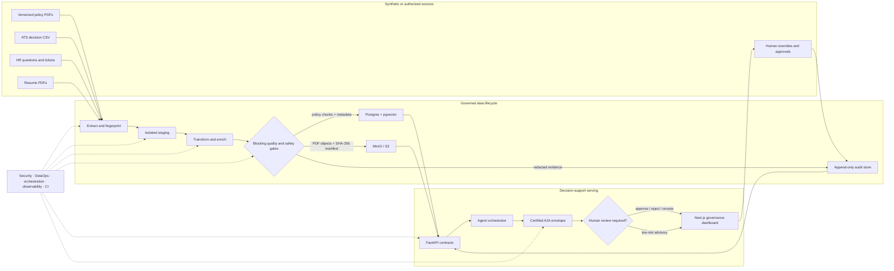
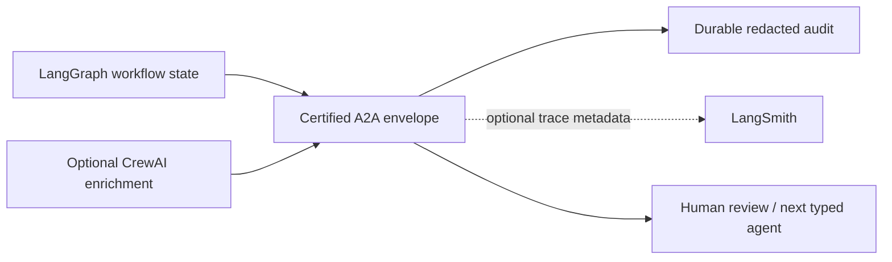

# Data Engineering Architecture

## Common vision

The HR AI Command Center is a governed data product, not a collection of model
calls. Its shared objective is:

> Turn synthetic or explicitly authorized HR inputs into reviewable decision
> support while preserving provenance, redacting sensitive data, rejecting
> unsafe instructions, and producing evidence for every automated handoff.

This is the data-system form of the product rule in `MISSION.md`: **Fleet acts,
policy evidence grounds, and governance controls.** The model is an optional
processor. Versioned data, deterministic controls, workflow state, human
decisions, and audit evidence are the durable product.

## Source model

The design combines four useful ideas from the referenced material:

- ETL is the ordered extract-transform-load pattern; broader data pipelines may
  also use ELT, streaming, CDC, or reverse ETL. See [Estuary's ETL
  overview](https://estuary.dev/blog/what-is-an-etl-pipeline/).
- A staging layer protects source systems and gives validation/cleaning a stable
  boundary before loading. See the [GeeksforGeeks ETL architecture
  summary](https://www.geeksforgeeks.org/software-testing/what-is-an-etl-pipeline/).
- The engineering lifecycle is larger than ETL: generation, ingestion, storage,
  transformation, and serving, with security, DataOps, architecture,
  orchestration, and software engineering crossing every stage. See [The Data
  Engineering Lifecycle](https://dev.to/mirinagonzales/the-data-engineering-lifecycle-2n7m).
- Production data work needs isolated unit tests, non-production integration
  runs, branch/environment-specific targets, and blocking data audits. See
  Netflix's [ETL Development Life Cycle with
  Dataflow](https://netflixtechblog.medium.com/etl-development-life-cycle-with-dataflow-9c70c64aba7b).

For this product the practical architecture is **hybrid ETL**:

- Sensitive text is transformed before durable persistence: normalize, detect
  injection, redact PII, then load the redacted audit representation.
- Synthetic analytics data can be loaded into an isolated staging target and
  transformed there because it contains no real employee data.
- Policy documents are parsed and assigned temporal metadata before embedding;
  expired versions are removed from the eligible retrieval set before answer
  synthesis.

## Relationship diagram



The important relationship is the feedback edge: human decisions return as
append-only evidence, not automatic training labels. A future training pipeline
must create a separately versioned and approved dataset.

## Building blocks

| Lifecycle block | Current implementation | Data contract | Blocking control | Served consumer |
|---|---|---|---|---|
| Generate | `scripts.generate_hackathon_datasets` | 40 policy PDFs, 10,000 ATS rows, 500 guardrail probes, 1,000 resume PDFs | Deterministic seed and manifests | Local evals and judge demo |
| Extract | `pipelines.ingestion`, CSV readers, resume manifest | PDF text/chunks, typed CSV rows, object paths | Parse errors, required columns, non-empty inputs | Transform stage |
| Stage | Ignored `backend/sample_data/hackathon` or isolated test DB | Source manifest plus local files | Synthetic-only warning and no production target | Certifier and optional loaders |
| Transform: policy | PDF chunking plus temporal metadata extraction | `policy_family`, `effective_date`, `expires_on`, `status`, `chunk_index` | Exclude expired, inactive, superseded, and future-effective chunks | RAG retrieval |
| Transform: safety | `core.guardrails`, `core.safety` | injection flag plus redacted representation | Prompt injection blocks; SSN cannot reach audit/provider payload | Agents and audit |
| Transform: bias | `core.bias_audit` | per-group counts, selection rates, impact ratios | Alert when the ratio is below 0.80 | Bias API and 3D radar |
| Transform: resume | PDF manifest plus Fireworks-style JSONL | deterministic custom ID, advisory output contract | SHA-256, count, schema, no autonomous hiring decision | Batch/VLM path |
| Load: retrieval | `services.rag` to pgvector, Qdrant, or local SQL cosine | chunk text, vector, temporal metadata | Ingest and retrieval use one active backend | Policy Q&A and retention support |
| Load: objects | `scripts.upload_resume_dump` | `s3://` URI, byte count, SHA-256 | Dry run by default; explicit credentials for upload | Batch preparation |
| Serve | FastAPI routes and Next.js dashboard | consistent JSON and typed frontend models | RBAC, confidence state, human review | HR operators and auditors |
| Evidence | audit rows and certification JSON | run status, gate details, route, latency/cost metadata | Claims require a matching measured artifact | CI, reviewers, compliance |

## Calculation blocks

### 1. Temporal policy eligibility

For policy family `f`, retrieval may use only records that are active on the
evaluation date:

```text
eligible(d, today) =
    d.effective_date <= today
    AND d.status NOT IN {expired, inactive, superseded, retired}
    AND (d.expires_on IS NULL OR d.expires_on >= today)

winner(f) = arg max d.effective_date over eligible documents in family f
```

The strict document-ID year is a compatibility fallback for old rows. New PDF
ingestion persists the temporal fields and the filter uses those fields.

### 2. Four-Fifths audit

For each group `g` in one protected dimension:

```text
selection_rate(g) = selected(g) / applicants(g)
reference_rate = max(selection_rate(g))
impact_ratio(g) = selection_rate(g) / reference_rate
dimension_ratio = min(impact_ratio(g))
alert = dimension_ratio < 0.80
```

The synthetic race fixture is expected to produce approximately `0.50 / 0.70 =
0.71`. This is an alerting rule of thumb, not a legal conclusion. The
[EEOC's guidance](https://www.eeoc.gov/laws/guidance/cm-621-height-weight-requirements)
notes that sample size and statistical or practical significance can also
matter; a human compliance review remains mandatory.

### 3. RAG review gate

```text
retrieval_confidence = top cosine score after temporal filtering
grounded = source_count > 0 AND citations are within retrieved context
needs_review = retrieval_confidence < backend_threshold OR NOT grounded
```

The local hashing backend uses a separately calibrated threshold because its
cosine scale differs from a neural embedding model. A backend label must travel
with evidence so scores from different embedders are not compared as if they
were interchangeable.

### 4. Attrition interaction term

```text
disengagement_index = last_promotion_months / max(manager_rating, epsilon)
```

This exposes a slow-burn interaction to the RandomForest without mining
employee messages. It is decision support only and cannot trigger an employment
action.

### 5. End-to-end latency

For sequential agent hops:

```text
T_total = T_intake + T_guardrail + T_retrieval + T_model + T_certification + T_audit
```

For independent work executed concurrently:

```text
T_parallel = max(T_retrieval, T_independent_tool_calls) + T_join
```

Parallelism is valid only for independent, awaited operations. The current BYOK
security contract intentionally forbids detached background tasks because a
request-scoped key must not outlive its request. Long live-model requests remain
a documented head-of-line/gateway-timeout risk until a secure job-token design
exists.

### 6. Evidence gate

```text
release_pass = all(contract_checks)
            AND all(data_quality_checks)
            AND all(safety_checks)
            AND all(required_integration_checks)
```

A skipped external check is `live_gated`, not passed. Local S3 planning does not
prove an upload; a static AMD manifest does not prove named-hardware execution;
mocked provider tests do not prove a live Fireworks call.

## Agent and data-system responsibilities

| Component | Correct responsibility | Must not become |
|---|---|---|
| LangGraph | Explicit state transitions, retries, checkpoints, and HITL pause/resume | A hidden free-form reasoning loop |
| CrewAI | Optional bounded narrative/enrichment around typed inputs and outputs | The source of workflow truth or authorization |
| Certified A2A envelope | In-process handoff contract carrying schema, route, cost/latency, redaction, and certification state | A claim that remote Agent2Agent interoperability is deployed |
| LangSmith | Optional external trace/cost sink when configured | A required control-plane dependency or audit system of record |
| pgvector/Qdrant/local store | Replaceable retrieval implementation behind one service contract | Independent stores that ingest and query different corpora |
| Fireworks/AMD model runtime | Configured capability tier selected from allowlisted models | A hardcoded dependency or evidence-free performance claim |

The dependency direction is deliberate:



If CrewAI or LangSmith is unavailable, the typed workflow and durable audit must
still work. If certification fails, the next agent receives no trusted payload.

## Environment and promotion model

| Environment | Data target | Expected proof |
|---|---|---|
| Unit/local | Temporary SQLite and generated files | Transform correctness, schema contracts, negative cases |
| Integration | Isolated Postgres/pgvector and MinIO namespace | Workflow wiring, persistence, object upload, query round trip |
| Preview | Seeded synthetic data and no server key | Full deterministic UX and honest fallback labels |
| Live provider | Explicit operator/BYOK credentials | Authenticated provider response and captured route/cost evidence |
| AMD runtime | Named GPU/ROCm/vLLM deployment | Health, model identity, shape/dtype, p50/p95, error, memory evidence |

Promotion follows the Netflix-inspired progression: local unit checks, isolated
integration targets, blocking data audits, then deployment. Branch names alone
must never redirect a test into production; environment variables and least-
privilege credentials define the target.

## Test and evidence matrix

| Gate | Fixture | Pass condition | Current evidence command |
|---|---|---|---|
| Source contract | Generated manifests | Exact default counts and expected files exist | `python -m scripts.generate_hackathon_datasets` |
| Temporal RAG | Conflicting 2023/2024 PTO PDFs | Answer contains 25, not 15; source is `policy_pto_2024`; metadata says active | `python -m scripts.certify_hackathon_synthetic_data --no-generate` |
| Bias | 10,000-row ATS CSV | Race ratio below 0.80 and alert emitted | Same certifier and `GET /metrics/bias-audit` |
| Guardrails | 500 PII/injection prompts | SSN redacted and every seeded jailbreak blocked | Same certifier |
| Resume batch | 1,000 PDFs/JSONL rows | Counts match and every object plan has SHA-256 | Same certifier |
| Notebook walkthrough | ETL validation notebook | All local cells and assertions complete | `make etl-certify` |
| pgvector integration | Live Postgres/pgvector | Active backend is `pgvector`; poisoned-policy query passes | `docs/evidence/local-etl-integration.json` and `make etl-live-certify` |
| MinIO integration | Live MinIO/S3 | Exactly 1,000 manifest objects listed; no missing/unexpected keys | Same curated artifact and command |
| Provider/AMD evidence | Configured live services | Smoke and benchmark artifacts verify only the claims made | Judge commands in `CLAIMS.md` |

## Mission alignment

| Product goal | Data-engineering mechanism | Outcome |
|---|---|---|
| Trustworthy by construction | Transform-before-persist for sensitive text; blocking gates | Unsafe data cannot quietly become trusted context |
| Human authority | HITL state and append-only approval/rejection evidence | Models advise; people decide |
| Auditability | Source fingerprints, temporal metadata, A2A envelope, evidence manifest | A reviewer can reconstruct what happened and why |
| Graceful degradation | Hashing embeddings, local SQL cosine, deterministic agent paths | The product remains testable without secrets or cloud services |
| Portability | One retrieval service over local, pgvector, or explicit Qdrant | Scale changes do not rewrite agent contracts |
| Honest performance | Local, live-provider, and named-hardware evidence are separate states | The pitch cannot outrun measured proof |

## Known limits

- The notebook alone proves deterministic transforms and an isolated RAG round
  trip. A separate curated snapshot now proves one local Docker pgvector/MinIO
  run; every new environment must rerun the integration certifier.
- The Four-Fifths ratio is a screening signal, not a final legal finding.
- Current request-scoped BYOK execution trades background scalability for key
  ephemerality; a secure asynchronous job runner is future work.
- LangSmith is optional and cannot replace the database audit trail.
- A2A is currently an internal certified-envelope pattern, not a deployed remote
  protocol between independently hosted agents.
- Live Fireworks and AMD claims remain gated until credentialed runtime evidence
  is captured.
