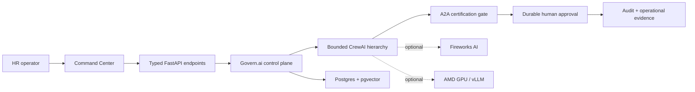
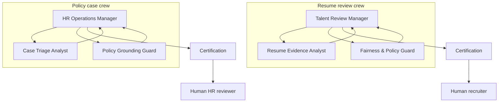

# Govern.ai


> **A governed HR agent control plane.** Govern.ai coordinates bounded AI
> workers, certifies every handoff, and stops sensitive employment workflows at
> a durable human approval gate.

Most HR AI demos end at a chat response. Govern.ai continues through the work:
validated inputs, manager-to-worker delegation, policy evidence, redaction,
structured outputs, approval tasks, audit history, and operational telemetry.
The model is a replaceable capability. The control plane owns the decision
boundary.

The local product works with no provider key. Live inference can use Fireworks
AI or a separately deployed AMD/vLLM endpoint. Those are distinct deployment
profiles, not interchangeable product claims.

## The product in one flow

An HR manager submits a policy case or resume review. The product orchestrator
validates and sanitizes the endpoint parameters, then delegates a bounded
subtask to a CrewAI hierarchy. Specialist evidence is certified before it can
cross an agent boundary. Risky or employment-sensitive output creates a durable
human-review task; it never becomes an autonomous adverse decision.



The crucial boundary is intentional: CrewAI performs a manager-led subtask;
it does not own tenants, authentication, budgets, durable workflow state, or
final employment decisions.

## Why this is competitive

| Product category | What it usually proves | What remains missing | Govern.ai difference |
|---|---|---|---|
| HR chatbot | A model can answer a prompt | Durable work, evidence, approvals, failure recovery | The response becomes a governed case or review task |
| Generic agent builder | Agents can call other agents | Domain policy, decision authority, auditable controls | HR-specific contracts and prohibited actions are enforced at handoffs |
| Workflow automation | Steps can be connected | Model uncertainty and output certification | Provider calls are optional, allowlisted, certified, and visibly gated |
| Govern.ai | A complete controlled workflow | Live-provider and scale evidence remain environment-gated | Endpoint → crew → certification → human decision → audit |

The hard technical difference is not the number of agents. It is where the
system refuses to trust them:

- Agents receive validated endpoint parameters; they do not fetch context from
  GitHub repositories.
- The product control plane owns routing, tenants, quotas, spend posture,
  persistence, audit, and approval state.
- Every cross-agent result uses a typed, PII-aware certification envelope.
- Explicit live mode fails closed when CrewAI or its allowlisted provider is
  unavailable.
- Deterministic mode proves the same topology and governance contracts without
  pretending that a provider call occurred.
- Hiring, attrition, compensation, termination, and other adverse actions remain
  human decisions.

## Run the judge-ready product

Requirements: Docker with Compose v2, `make`, `curl`, and Python 3.11 or newer.
No API key or GPU is required for the deterministic demo.

```bash
git clone https://github.com/W4sP4nx2/HR-AI-Operations.git
cd HR-AI-Operations
make judge-demo
```

Open [http://localhost:3000](http://localhost:3000). In another terminal run:

```bash
make judge-demo-check
```

The walkthrough gate verifies the frontend, seeded data, provider claim
boundaries, two CrewAI topologies, a three-hop governed crew run, the
addressable A2A extractor-to-policy-guard handoff, PII removal, creation of a
human approval task, and the Command Center queue update.

Useful URLs:

- Product: [http://localhost:3000](http://localhost:3000)
- API documentation: [http://localhost:8000/docs](http://localhost:8000/docs)
- Health and provider boundary: [http://localhost:8000/health](http://localhost:8000/health)
- Agent topology: [http://localhost:8000/crews/hierarchical](http://localhost:8000/crews/hierarchical)
- A2A graph: [http://localhost:8000/a2a/graph](http://localhost:8000/a2a/graph)
- Command Center snapshot: [http://localhost:8000/ops/overview](http://localhost:8000/ops/overview)

Stop the stack with:

```bash
docker compose -f docker-compose.yml -f docker-compose.hackathon.yml down
```

## Run an agent task through the endpoint

The demo profile disables authentication and provider spend. This request runs
the production-shaped hierarchy with deterministic workers and still creates a
real approval record:

```bash
curl --fail http://localhost:8000/crews/hierarchical/policy_case_resolution/run \
  -H 'Content-Type: application/json' \
  -d '{
    "mode": "deterministic",
    "inputs": {
      "ticket": "Urgent safety issue: what escalation path applies?",
      "policy_context": "Safety cases require an HR manager.",
      "policy_version": "demo-v1"
    }
  }'
```

The response exposes the execution mode, worker steps, certified handoffs,
guardrails, trace ID, `human_review_task_id`, and `hitl_status`. Change `mode`
to `live` only after configuring an allowlisted provider; live mode returns an
explicit unavailable response instead of silently falling back.

For the full two-request A2A transfer, including passing the extractor artifact
to the policy guard, run `make judge-demo-check` or inspect
[`scripts/hackathon_walkthrough.sh`](./scripts/hackathon_walkthrough.sh).

## Agent hierarchy and handoffs

Govern.ai exposes two manager-led CrewAI systems. Each manager delegates to two
non-delegating specialists and then hands a certified advisory output to a
human reviewer.



| Crew system | Required endpoint parameters | Manager | Workers | Human boundary |
|---|---|---|---|---|
| `resume_review` | `job_description`, `resume` | Talent Review Manager | Resume Evidence Analyst; Fairness & Policy Guard | A recruiter owns every hiring decision |
| `policy_case_resolution` | `ticket`; optional `policy_context`, `policy_version` | HR Operations Manager | Case Triage Analyst; Policy Grounding Guard | Urgent, sensitive, or ungrounded cases require HR review |

### Addressable A2A agent cards

The protocol surface is deliberately small and honest. These are independently
addressable HTTP roles inside one service today—not a claim of remote agent
federation.

| Agent card | Input | Output | Next handoff | Enforced governance |
|---|---|---|---|---|
| `resume_extractor` | `message.text` | Identity-free candidate profile | `policy_guard` | Raw resume is not forwarded; email and phone are removed |
| `policy_guard` | Extracted `profile` | Policy-bound advisory artifact | `human_reviewer` | Human approval required; reject/decide/override actions forbidden |

Discovery and execution:

- `GET /a2a/agents/{agent_name}/.well-known/agent-card.json`
- `POST /a2a/agents/{agent_name}/rpc` using JSON-RPC `message/send`
- `GET /a2a/graph` for the current deployment boundary and handoff graph

## Product agents

The product fleet supports five HR workflows. These are capability contracts,
not fictional personas.

| Product agent | Job | Guardrail |
|---|---|---|
| Policy Q&A | Retrieve policy evidence and produce citation-backed answers | No evidence means no confident answer |
| Case Triage | Classify and route HR requests | Urgent, ambiguous, or disputed cases escalate |
| Resume Screener | Extract and compare job-relevant evidence | Demographic blinding; advisory output only |
| Attrition Advisor | Explain model risk factors | No autonomous employment action |
| Onboarding Orchestrator | Coordinate account, training, and welcome steps | Pauses at the human checkpoint |

Agent routing metadata lives in typed cards: workload classes, output contract,
serving path, model-family preferences, cost posture, tools, collaboration
targets, review triggers, and AMD use case. Concrete model IDs are selected only
from `ALLOWED_MODELS` at runtime.

## Command Center: the operator studio

The dashboard is the control surface for building and operating governed agent
workflows—not a prompt playground.

| Surface | Operator action | Evidence shown |
|---|---|---|
| Guided product flow | Run policy, case, and approval scenarios | Grounding, status, and review boundary |
| 3D/2D Agent Fleet | Inspect live nodes, handoffs, queues, and provider gates | `/ops/overview` with runtime provenance |
| Governed CrewAI panel | Select a system, mode, and endpoint inputs | Worker steps, certification, provider call, approval task |
| Approval Queue | Approve, reject, or request changes | Durable task state and audit trail |
| Audit and Analytics | Inspect agent actions and operational metrics | Exportable history and explicit measured/gated labels |
| Advanced controls | Configure integrations and runtime settings | Capability readiness without exposing secrets |

### Reusable building blocks

| Building block | Contract |
|---|---|
| Agent Card | Capability, accepted workload, tools, risk, model preference, review triggers |
| Crew System | Manager, bounded workers, required inputs, expected output, human boundary |
| Certified A2A Envelope | Source, target, schema validation, PII gate, trace, cost metadata |
| Human Task | Durable approval state linked to orchestration and audit IDs |
| Provider Gateway | Allowlisted model, timeout/retry budget, explicit unavailable state |
| Operations Snapshot | Tenant-scoped agents, queues, gates, providers, and provenance |
| Resume Job | Idempotent manifest, tenant quota, progress, cancellation, retry, parser certification |

## Integrations and deployment profiles

| Integration | Current status | Purpose |
|---|---|---|
| CrewAI | Shipped; live execution is provider-gated | Hierarchical manager/worker subtasks |
| A2A-shaped JSON-RPC | Shipped in one service | Discoverable cards and independently addressable handoffs |
| Postgres 16 + pgvector HNSW | Shipped in Docker | Durable product state and default production RAG backend |
| Supabase/Postgres RLS migration | Foundation included; deployment not certified | Tenant membership, quotas, budgets, jobs, and audit boundaries |
| MinIO / private object storage contract | Shipped locally; signed production adapter required | Large resume objects outside request memory |
| Fireworks AI | Credential-gated | Hosted OpenAI-compatible inference and Batch |
| AMD GPU + vLLM | Separate runtime-evidence gate | Self-hosted OpenAI-compatible Gemma-family inference |
| LangSmith | Optional and redacted | Nested orchestration trace metadata |
| Webhooks and REST API | Shipped | ATS, ticketing, and form integration boundary |

### Configuration profiles

| Profile | Required settings | Claim boundary |
|---|---|---|
| Deterministic judge demo | None; use the hackathon Compose overlay | No provider or GPU call is claimed |
| Fireworks live | `LLM_PROVIDER=fireworks`, `FIREWORKS_API_KEY`, `FIREWORKS_BASE_URL`, `ALLOWED_MODELS` | Hosted inference only after the live smoke gate passes |
| Fireworks Batch | Fireworks live settings plus `FIREWORKS_CONTROL_BASE_URL`, `FIREWORKS_ACCOUNT_ID`, `FIREWORKS_BATCH_MODEL` | Asynchronous batch, not interactive completion |
| AMD/vLLM | `LLM_PROVIDER=amd_vllm`, `AMD_VLLM_BASE_URL`, `AMD_VLLM_API_KEY`, `AMD_VLLM_SERVED_MODEL`, matching `ALLOWED_MODELS` | AMD claim requires captured named-hardware evidence |
| Production control plane | `AUTH_ENFORCE=true`, strong `JWT_SECRET`, private `DATABASE_URL`, tenant-scoped object storage | Demo credentials and open registration are not production settings |

See [`backend/.env.example`](./backend/.env.example) and
[`backend/.env.live.example`](./backend/.env.live.example) for the complete
configuration contract. Never commit provider keys.

## Large-resume and concurrency target

Product target: **100 concurrent chat users, 1,000 resumes/day, up to 50 pages
or 25 MB per resume, 10 concurrent resume jobs per tenant, with tenant quotas
and spend budgets.**

| Requirement | Implemented now | Still required before a production claim |
|---|---|---|
| 50 pages / 25 MB | Admission validation and bounded parser | Signed storage fetch adapter and production corpus validation |
| 10 concurrent resume jobs | Tenant admission quota, durable state, idempotency, cancel/retry | External worker deployment and distributed claim/lease handling |
| 1,000 resumes/day | Asynchronous job contract avoids long HTTP work | Measured queue, storage, parser, provider, and cost throughput |
| 100 concurrent chat users | Server-owned conversation history and ownership checks | Published load test with p50/p95, errors, database and provider saturation |
| Tenant isolation | Tenant-aware contracts and Postgres/Supabase RLS migration | Apply and verify RLS against a real deployment |
| Spend budgets | Model allowlist, cost routing metadata, provider gating | Durable per-tenant reservation/settlement ledger and hard admission block |

This is the main production gap: the control-plane contracts exist, but a live
Postgres/Supabase deployment, distributed resume workers, enforceable spend
ledger, and measured load evidence are still required. The README does not turn
targets into claims.

## Failure behavior and guardrails

- A missing live provider returns `unavailable`; it is not reported as success.
- A provider error after GPU/model execution begins is not swallowed and rerun
  as if nothing happened.
- Prompt injection, PII leakage, schema failure, missing policy evidence, agent
  disagreement, and sensitive action language can block or escalate a handoff.
- Large resumes are admitted as durable manifests; parsing does not monopolize
  the HTTP request.
- Parser coverage must be certified before model scoring is allowed.
- pgvector HNSW remains the default production RAG path. Triton and hipVS remain
  gated experiments until named-hardware correctness and latency evidence pass.
- No AMD performance claim is valid without hardware, software versions, shape,
  dtype, p50/p95, numerical error, and memory evidence.

## Verification

```bash
# Focused agent, A2A, control-plane and frontend production checks
make verify

# Full backend regression suite
make test

# Validate Docker configuration without starting services
docker compose -f docker-compose.yml -f docker-compose.hackathon.yml config --quiet

# Validate the running end-to-end judge stack
make judge-demo-check
```

The current evidence boundary and judge script are documented in
[`HACKATHON_SUBMISSION.md`](./HACKATHON_SUBMISSION.md). Production architecture,
scale gates, and remaining work are tracked in
[`docs/PRODUCTION_AGENT_PLATFORM_SPEC.md`](./docs/PRODUCTION_AGENT_PLATFORM_SPEC.md).
Security hardening is in [`SECURITY.md`](./SECURITY.md), and per-agent behavior
is in [`AGENT_PLAYBOOK.md`](./AGENT_PLAYBOOK.md).

## Repository map

```text
backend/                  FastAPI control plane, agents, storage, guardrails, tests
frontend/                 Next.js Command Center and typed API client
backend/migrations/       Postgres/Supabase platform foundations
docs/                     Architecture, evidence, product and operations material
scripts/                  Walkthrough, deployment and evidence gates
docker-compose.yml        Local Postgres, backend, frontend and object storage
docker-compose.hackathon.yml  Deterministic zero-spend judge overlay
docker-compose.amd.yml    Separate AMD/vLLM deployment profile
```

## License

See [`LICENSE`](./LICENSE).
