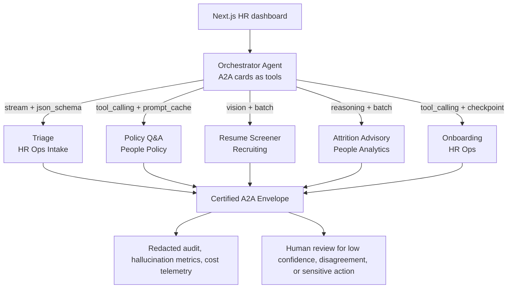
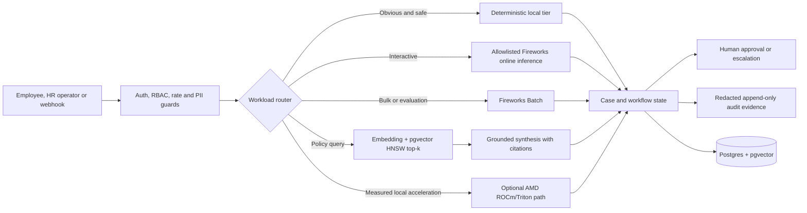
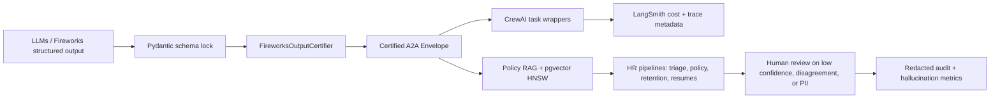

# HR AI Command Center


> **An open-source control plane for governed HR agent workflows.** It routes
> tickets, answers questions from versioned policy evidence, screens resumes,
> coordinates onboarding, and produces attrition advisories. Sensitive outcomes
> remain reviewable, auditable, and reversible.

> **Demo status:** no hosted demo URL is claimed. The former hosted demo path is
> retired; run the local Docker Compose stack or the AMD overlay described below.
> The local app supports the same request-scoped BYOK flow when a temporary
> Fireworks key is explicitly provided. Keys remain in browser memory, are sent
> only to verification/model-capable routes as `X-Client-LLM-Key`, and are never
> stored, logged, or written to the database. Without a key, every feature still
> works in deterministic fallback mode.

A FastAPI backend orchestrates five specialised agents plus a Pydantic AI
assistant over a RAG pipeline backed by **Postgres + pgvector**. A Next.js 16
dashboard provides authentication, RBAC, policy management, fleet monitoring,
case workflows, human approvals, audit evidence, analytics, and asynchronous
Fireworks Batch status. Docker Compose is the local/demo runtime; Fireworks
Serverless is the hosted inference path when explicitly configured.

The common product rule is simple: **Fleet acts, policy evidence grounds, and
governance controls.** Deterministic workflows remain usable without a model;
allowlisted Fireworks or self-hosted AMD inference adds capability when it is
explicitly configured. The system supports human decisions and never performs
autonomous adverse employment actions.

Authentication has three separate trust boundaries: the application JWT proves
the user's identity and role; a Fireworks key funds hosted inference (server
secret or memory-only, request-scoped BYOK); and `AMD_VLLM_API_KEY` authenticates
the backend to its private AMD inference service. Browser BYOK is disabled in
the AMD profile, and `HF_TOKEN` is mounted only into the GPU pod for gated Gemma
weight download. `/health` reports `byok_supported` so the UI can show the
Fireworks control only when it is valid for the active provider.

## Try it in 2 minutes

```bash
# One-command zero-spend preview
make preview
```

Open `http://127.0.0.1:3001`, then go to **Analytics → Dynamic Capability
Engine**. In the local preview, Fireworks and AMD/Gemma intentionally show
`live_gated`; the deterministic fallback should show `measured_local`.

In a second terminal, verify the running preview:

```bash
make preview-check
```

Useful release checks:

```bash
make evidence   # writes capability-evidence.json without live provider calls
make verify     # focused backend tests + frontend production build
make etl-certify # synthetic ETL, temporal RAG, bias, guardrail and notebook gates
```

Manual startup remains available:

```bash
# Backend (zero secrets needed)
cd backend && python -m venv .venv && source .venv/bin/activate
pip install -r requirements.txt
python -m scripts.seed_data          # sample policies, cases, chats
uvicorn api.main:app --reload --port 8000

# Frontend
cd ../frontend && npm install && npm run dev   # http://localhost:3000
```

Everything runs in **deterministic fallback mode** with no API key. For live
Fireworks runs, set `LLM_PROVIDER=fireworks`, `FIREWORKS_API_KEY`,
`FIREWORKS_BASE_URL`, and `ALLOWED_MODELS` from the harness. Those values are
intentionally not defaulted in code; `/health` reports missing provider config.
Set `AUTH_ENFORCE=true` to turn RBAC from advisory into enforced. See
[SECURITY.md](./SECURITY.md).

For live validation, copy [backend/.env.live.example](./backend/.env.live.example)
and replace placeholders with real values. Required inputs:

- `FIREWORKS_API_KEY`
- `FIREWORKS_BASE_URL`
- exact `ALLOWED_MODELS`
- optional `FIREWORKS_VISION_MODEL`
- `AMD_VLLM_BASE_URL`
- `AMD_VLLM_API_KEY`
- `AMD_VLLM_SERVED_MODEL`
- `AMD_RUNTIME_EVIDENCE_FILE`

## Why this is not an API wrapper

The product separates durable workflow state from optional model inference:

| Plane | Current responsibility | Failure behaviour |
|---|---|---|
| **Long-running core** | FastAPI, Postgres, pgvector, cases, RBAC, approvals and audit | Continues without a model provider |
| **Deterministic tier** | Obvious triage, hashing embeddings, local scoring and templated explanations | Zero model spend and reproducible output |
| **Fireworks online tier** | Ambiguous classification, grounded synthesis, streaming chat and structured requests | Bounded retries, explicit unavailable state, deterministic fallback |
| **Fireworks Batch tier** | Prepared JSONL, dataset upload, asynchronous job submission and normalized status | Interactive workflows continue while jobs queue or fail |
| **AMD acceleration tier** | Optional Triton cosine scoring and AMD GPU inference deployment manifests | Disabled until correctness and named-hardware speed gates pass |

The router uses the least complex tier that satisfies the task. An urgent or
unambiguous ticket can bypass the LLM; policy synthesis can use an allowlisted
online model; bulk work can use Batch; custom or reserved-capacity models are
treated as dedicated-deployment candidates.

## Provider-Orchestrated Product Core

The hackathon thesis is not "one chatbot calls one model." The backend now
models hosted and self-hosted inference as a governed capability layer with
explicit serving primitives: streaming, JSON schema, tool calling, reasoning,
vision, embeddings, prompt-cache locality, and Batch. Fireworks' current docs
recommend choosing models by workload class, and the quickstart documents
OpenAI-compatible streaming, function calling, structured outputs, reasoning,
and vision requests:
[recommended models](https://docs.fireworks.ai/guides/recommended-models) and
[serverless quickstart](https://docs.fireworks.ai/getting-started/quickstart).

The implementation rule remains strict: **no model ID is a code default**.
`backend/agents/a2a_cards.py` records model-family preferences such as `flash`,
`qwen`, `kimi`, `deepseek`, `reason`, `vision`, `gemma`, and `gamma`; concrete
selection happens in `backend/agents/orchestrator.py` from `ALLOWED_MODELS`
only. If your Fireworks project uses a Gemma/Gamma-family model, put its exact
Fireworks model ID in `ALLOWED_MODELS`; the resume/VLM card will prefer that
family without hardcoding it.

| Product feature | Fireworks primitive | Backend building block | Cross-team A2A handoff |
|---|---|---|---|
| Real-time HR ops intake | Streaming + JSON schema | `triage_agent` card, `/agents/orchestrator/plan`, SSE chat stream | HR Ops → People Policy or Onboarding |
| Policy Q&A and retention support | Tool calling + prompt cache + structured output | RAG over pgvector, `FireworksOutputCertifier`, citation checks | People Policy → Retention Resolver |
| Resume screening | Vision + Batch + JSON schema | `resume_screener_agent`, `build_resume_vision_body`, certified Batch outputs | Recruiting → Skill Validator |
| Attrition advisory | Reasoning + Batch + JSON schema | sklearn score plus reasoning-path narrative contract | People Analytics → Policy Q&A |
| Onboarding workflow | Tool calling + schema-bound state | LangGraph checkpoint and human approval gate | HR Ops → IT/account tools |
| Governance dashboard | Certified A2A envelopes + cost telemetry | `/lifecycle/fireworks`, `/lifecycle/hallucination_metrics` | Audit, security, and ops review |

The orchestrator exposes every agent as an OpenAI-compatible tool description,
including serving path, Fireworks primitives, cost posture, risk posture, and
human-review triggers. This gives the system a concrete A2A collaboration
contract: agents do not hand off raw text; they hand off certified envelopes
with model route, cost tier, cross-agent consistency metadata, and certifier
evidence.



No-key validation:

```bash
cd backend
ALLOWED_MODELS="accounts/fireworks/models/deepseek-v3p1" \
python3 - <<'PY'
from agents.orchestrator import build_orchestration_plan

plan = build_orchestration_plan(
    "resume_analysis",
    {"image_urls": ["data:image/png;base64,AAAA"], "prompt": "Extract this scanned resume."},
)
print(plan.selected_agent, plan.dispatch_mode, plan.selected_model)
PY
```

Follow-up gates:

- Live smoke: run `python3 backend/scripts/fireworks_smoke.py --enable-cost-tracking`
  only after `FIREWORKS_API_KEY`, `FIREWORKS_BASE_URL`, and `ALLOWED_MODELS` are set.
- Product UI: surface `/agents/orchestrator/plan` beside each manual agent trigger
  so judges can see the selected Fireworks primitive before execution.
- Benchmarks: report TTFT, tokens/sec, JSON schema pass rate, batch completion
  time, and certification failure rate; do not publish AMD performance claims
  without named hardware and captured evidence.
- A2A expansion: keep the current in-process envelope contract, then replace one
  edge at a time with remote A2A once the Agent Card/task lifecycle is stable.

## Implementation status

| Capability | Status | Evidence |
|---|---|---|
| Deterministic no-key application | **Implemented** | Full backend suite and seeded demo |
| Policy RAG with pgvector HNSW | **Implemented** | Round-trip and retrieval tests |
| Role-specific model routing and sampling | **Implemented** | Lifecycle policy and factory tests |
| Fireworks structured/VLM resume path | **Implemented, consent and credential-gated** | In-memory PDF rendering and schema/contract tests; live provider run pending |
| Fireworks Batch prepare/submit/status/watch | **Implemented, credential-gated** | JSON/JSONL/PDF-folder preparation, durable metadata ledger, mock transport tests and dashboard status |
| Kubernetes/HPA/GPU manifests | **Future-state templates** | Retained for later scale-out; not required for the hackathon or current demo |
| Triton 256–2048 dimension tiles, 4/8 warps and multi-row grid mapping | **Implemented, disabled by gate** | CPU correctness oracle; ROCm benchmark pending |
| hipVS vector search | **Experiment only** | Not integrated |
| SFT/RLHF | **Not implemented** | Feedback is collected for analysis but never trains or steers a model automatically |

Published performance claims require committed benchmark artifacts. The project
does **not** currently claim 10x retrieval, 5x resume throughput, 40% lower cost,
99.99% availability, 10,000 concurrent users, or production fine-tuning.

## Documentation map

`README.md` is the current-state contract. [MISSION.md](./MISSION.md) defines the
non-negotiable principles, [PRODUCT.md](./PRODUCT.md) defines users and product
boundaries, and the implementation/evidence documents must agree with those
three sources. Dated reports are snapshots, not statements about the current
worktree.

| Doc | What |
|-----|------|
| [OVERVIEW.md](./OVERVIEW.md) | Concise product overview, workflow and project structure |
| [MISSION.md](./MISSION.md) · [PRODUCT.md](./PRODUCT.md) | Shared vision, users, boundaries and product direction |
| [CONTEXT.md](./CONTEXT.md) | Compact assistant handoff context for Qwen/Codex without token overload |
| [IMPLEMENTATION.md](./IMPLEMENTATION.md) · [PITCH.md](./PITCH.md) | Current engineering map and concise project narrative |
| [CLAIMS.md](./CLAIMS.md) | Judge-facing claim ledger for Fireworks powered auth, Gemma/Gamma powered routing, and AMD powered deployment evidence |
| [HACKATHON_JUDGE_BRIEF.md](./HACKATHON_JUDGE_BRIEF.md) | One-page judge brief with thesis, demo moments, evidence commands and safe wording |
| [HACKATHON_GEMMA_AMD_DEPLOYMENT.md](./HACKATHON_GEMMA_AMD_DEPLOYMENT.md) | Fireworks auth profile, AMD-hosted Gemma deployment path, judge winpoints and evidence pack |
| [HACKATHON_COMPLETION_AUDIT.md](./HACKATHON_COMPLETION_AUDIT.md) | Requirement-by-requirement hackathon blueprint audit, proven claims and live-gated claims |
| [HACKATHON_SYNTHETIC_DATA.md](./HACKATHON_SYNTHETIC_DATA.md) | Reproducible poisoned-policy, adverse-impact, PII/injection and resume-batch datasets |
| [docs/evidence/local-etl-integration.json](./docs/evidence/local-etl-integration.json) | Curated local Docker pgvector + MinIO integration evidence; no provider or performance claim |
| [OPEN_SOURCE_LAUNCH.md](./OPEN_SOURCE_LAUNCH.md) | Authoritative pre-push and release checklist |
| [COMPETITIVE_QUALITY_GATE.md](./COMPETITIVE_QUALITY_GATE.md) | Executable security, vector, Fireworks, audit and release gates |
| [LAUNCH_PLAN.md](./LAUNCH_PLAN.md) | Demo script and hosting path |
| [USECASES.md](./USECASES.md) | Employee, HR, recruiter, onboarding, attrition and audit workflows |
| [AGENT_PLAYBOOK.md](./AGENT_PLAYBOOK.md) | Per-agent contracts, use cases & workflows |
| [TEST_PLANS.md](./TEST_PLANS.md) | Agent, RAG, pipeline, BYOK, UI and attrition scenario test plans |
| [USER_MANUAL.md](./USER_MANUAL.md) · [OPERATIONS_MANUAL.md](./OPERATIONS_MANUAL.md) | End-user & operator guides |
| [SCALING.md](./SCALING.md) | Scaling architecture, gaps and evidence gates |
| [SECURITY.md](./SECURITY.md) | Security posture & hardening |
| [COMPLIANCE.md](./COMPLIANCE.md) | Auditor evidence pack, bias tests, RBAC matrix |
| [MODEL_CARDS.md](./MODEL_CARDS.md) | Per-agent model cards (EU AI Act / LL144) |
| [BASELINE_MODELS.md](./BASELINE_MODELS.md) | Three CPU-safe baselines, metrics, limitations and discard gates |
| [GENAI_LIFECYCLE.md](./GENAI_LIFECYCLE.md) | Inputs, transformations, prompts, scoring, labels and lifecycle stages |
| [DATA_ENGINEERING_ARCHITECTURE.md](./DATA_ENGINEERING_ARCHITECTURE.md) | ETL/data lifecycle, calculations, A2A relationships, environment promotion and evidence boundaries |
| [notebooks/hr_governance_etl_validation.ipynb](./notebooks/hr_governance_etl_validation.ipynb) | Executable synthetic ETL and governance validation walkthrough |
| [PLATFORM_OPERATIONS.md](./PLATFORM_OPERATIONS.md) | GPU scaling, GitOps, observability, security and multi-pod operations |
| [GPU_OPTIMIZATION.md](./GPU_OPTIMIZATION.md) | Batch ingestion, portable Triton design, benchmark gates and pending results |
| [FIREWORKS_AI.md](./FIREWORKS_AI.md) | Fireworks vision, functional requirements, routing, scaling and next steps |
| [AMD_HACKATHON_STRATEGY.md](./AMD_HACKATHON_STRATEGY.md) | Evidence-backed AMD/Fireworks pitch, demo, benchmarks and claim gates |
| [MCP_INTEGRATION.md](./MCP_INTEGRATION.md) | Read-only MCP product boundary, local setup and protocol evaluation |
| [docs/diagrams](./docs/diagrams/README.md) | Editable technical, product, user, agent, and operations flows |
| [WEBAPP_TEST_REPORT.md](./WEBAPP_TEST_REPORT.md) | Targeted browser QA, fixes, evidence and remaining runtime checks |
| [DEPLOYMENT.md](./DEPLOYMENT.md) | Docker Compose / AMD demo deployment; Fireworks Serverless inference; Kubernetes future state |
| [DEPLOYMENT_STATUS.md](./DEPLOYMENT_STATUS.md) · [SHOWCASE_READINESS.md](./SHOWCASE_READINESS.md) | Dated operational and readiness evidence |
| [CONTRIBUTING.md](./CONTRIBUTING.md) | How to contribute |

## Before you run it — costs, privacy & access

- **💸 Bring your own API key.** Live LLM features call Fireworks and **cost money**;
  free-tier rate limits apply. The app runs **fully without a key** in
  deterministic mode. Set `MOCK_LLM=true` to guarantee **zero LLM spend**.
  Policy answers are cached
  (`POLICY_CACHE_SIZE`) to cut repeat cost.
- **🔒 Data movement is explicit.** Audit logs stay local; **PII
  (emails/phones/SSNs/cards) is redacted before it is written or sent to model
  tools** (`REDACT_PII=true`). Live Fireworks calls happen **only when explicitly
  triggered**. Scanned resume images are the explicit exception because pixels
  may contain PII: VLM processing is disabled unless `ENABLE_RESUME_VLM=true`.
  Review your provider agreement before using real employee data.
- **👤 First-run admin.** With open registration, the **first account becomes
  admin**. For enforced setups, set `ADMIN_EMAIL` + `ADMIN_PASSWORD` (admin is
  created on boot) or run `python -m scripts.seed_admin --email you@org.com --password '…'`.
- **🧭 Support boundary.** The OSS build is **advisory-mode by default**
  (`AUTH_ENFORCE=false`) so it's instantly usable. Enforced RBAC, SSO, and
  multi-tenant are **self-host tuning** — set `AUTH_ENFORCE=true` and see
  [SECURITY.md](./SECURITY.md) and [SCALING.md](./SCALING.md). This is a reference
  implementation, not a managed service.
- **🔥 Fireworks submission mode.** Do not hardcode `FIREWORKS_BASE_URL` or model
  ids. The backend selects only from `ALLOWED_MODELS`, and static tests fail if
  forbidden provider hosts or direct LLM clients are reintroduced outside the
  factory choke points. With real harness env set, run
  `cd backend && python -m scripts.fireworks_smoke` before submitting.
- **🏁 AMD-hosted Gemma track.** For the judged “Best AMD-Hosted Gemma Project”
  run, use [HACKATHON_GEMMA_AMD_DEPLOYMENT.md](./HACKATHON_GEMMA_AMD_DEPLOYMENT.md):
  Fireworks auth proves the API/BYOK path, while `LLM_PROVIDER=amd_vllm` proves
  the same product workflow can route to a Gemma-family model served on AMD
  ROCm/vLLM. A live **AMD powered** claim additionally requires the validated
  device/ROCm/vLLM payload from `scripts/capture_amd_runtime_evidence.py`; a
  deployment manifest alone is not hardware proof. Use `make judge-static`
  before rehearsals, `make judge-fireworks-live` for the hosted auth proof, and
  `make judge-amd-live` on the canonical single-host AMD Compose deployment.
- **🏷️ Submission keywords.** Use the short judge-facing hooks **AMD powered**,
  **Gemma powered** / **Gamma powered**, and **Fireworks powered**. Keep the
  official model spelling as “Gemma” in technical evidence; “Gamma” is only a
  keyword alias if needed by the submission copy.

See [`backend/.env.example`](./backend/.env.example) for every flag.

## Architecture



The frontend and API containers are stateless deployment targets. Postgres is
the authoritative datastore in production; SQLite remains a local-development
mode. The Kubernetes manifests are retained as future-state templates and are
not part of the current demo or hackathon acceptance path.

## Anti-Hallucination Architecture

Hallucination in HR AI is treated as a compliance failure, not a cosmetic model
mistake. The product uses a triple-lock path before an answer reaches another
agent or the UI:

| Layer | Enforcement | Failure behavior |
| --- | --- | --- |
| Schema enforcement | `ChatResponse` and Pydantic AI structured output enforce required fields, `max_length=500`, confidence bounds, and enum values. | Invalid model shape is rejected before it becomes a user-facing answer. |
| Certification enforcement | `FireworksOutputCertifier` re-validates JSON schema, checks PII with regex fallback, extracts confidence, and redacts unsafe payloads. | Failed certification produces an empty A2A payload, so the next agent receives `{}` instead of garbage. |
| RAG grounding enforcement | Policy Q&A retrieves top-k policy chunks through pgvector/vector backends, requires citations, and stores source policy IDs in governed chat output. | Missing citations lower confidence and trigger human review instead of fabricated policy guidance. |

Triple-lock guarantee: a hallucinated response must bypass schema validation,
pass certification, and fabricate valid policy citations before it can be
accepted. Runtime evidence is exposed at `/lifecycle/hallucination_metrics`:
certification failure rate by agent, human override/rejection rate, citation
completeness, and PII leak incidents.



Key connections:
- LLMs produce structured JSON, but Pydantic and the certifier decide whether it
  is usable.
- A2A envelopes carry certification, cost, latency, model route, and
  cross-agent consistency metadata.
- CrewAI and LangSmith are observability/adaptation layers; they do not bypass
  certification.
- RAG citations are product evidence. Answers without source policy IDs become
  reviewable, not authoritative.
- The real-time budget circuit breaker forces economy routing and extends cache
  TTL when estimated spend crosses `DAILY_INFERENCE_BUDGET_USD`.

Verification commands:

```bash
# Refuses live smoke without required Fireworks config.
python3 backend/scripts/fireworks_smoke.py --enable-cost-tracking

# Adversarial attacks: prompt injection, obfuscated SSN, schema breaks,
# and cross-agent disagreement must all be caught.
cd backend
PYTEST_DISABLE_PLUGIN_AUTOLOAD=1 python3 -m pytest tests/test_adversarial_inputs.py -v

# Triple-lock mock validation is covered by:
PYTEST_DISABLE_PLUGIN_AUTOLOAD=1 python3 -m pytest tests/test_deterministic_certification.py -q

# Runtime dashboard JSON:
python3 -c "from fastapi.testclient import TestClient; from api.main import app; print(TestClient(app).get('/lifecycle/hallucination_metrics').json())"
```

## Platform risk controls

The default demo path is Docker Compose. Fireworks Serverless handles hosted
inference when configured. AMD inference uses
[`docker-compose.amd.yml`](./docker-compose.amd.yml) with a pinned AMD-verified
ROCm/vLLM `gfx94X` image, `linux/amd64`, `/dev/kfd`, and `/dev/dri`; the host
still needs a compatible AMD kernel driver. Kubernetes remains a future-state
scale-out template rather than a demo dependency.

Fireworks Batch is explicitly asynchronous. Submitted jobs appear as
`PENDING`, are polled every 10 seconds, and do not block interactive screening.
The UI asks operators to inspect model support, dataset validity, and quota when
a job remains pending for 30 minutes.

Compose scaling output is marked `simulated: true`. It demonstrates scaling
policy behavior without being presented as live telemetry. Only runtime logs
from named AMD hardware, including GPU model, utilization, memory, software
versions, shape, dtype, latency, and numerical error, qualify as acceleration
evidence.

[View the platform risk-control PNG](./docs/diagrams/previews/platform-risk-controls.png)
or edit the [Excalidraw scene](./docs/diagrams/platform-risk-controls.excalidraw).
The broader [operations flow](./docs/diagrams/previews/operations-flow.png)
shows how those controls fit into delivery, runtime, observability, and release.

## The five agents

| Agent | Framework | What it does |
|-------|-----------|--------------|
| **Policy Q&A** | LangGraph `StateGraph` | RAG over HR policy PDFs in **pgvector** (top-k cosine via the RAG service). Returns answer, source documents, a confidence score and a `needs_review` flag; refuses prompt-injection; logs every query to the audit table. |
| **Onboarding Orchestrator** | LangGraph | `validate → create_accounts → assign_training → [human checkpoint] → send_welcome_email → notify_manager`. State persists to SQLite; pauses for human approval and emits a WebSocket event. |
| **Resume Screener** | CrewAI (3 agents) | JD Parser → Resume Scorer → Recommendation. Uses sentence-transformers for semantic similarity. Returns `{score, recommendation, reasoning, matched_skills, missing_skills}`. |
| **Triage** | CrewAI | Classifies tickets into BENEFITS / POLICY / ONBOARDING / PERFORMANCE / COMPLIANCE / URGENT. URGENT → human; POLICY → auto-resolved via RAG. |
| **Attrition Predictor** | scikit-learn | `RandomForestClassifier` on six features; returns risk score + top factors, with an optional provider-generated explanation. Trains on synthetic data at startup. |

Agent outputs are advisory. Resume recommendations and attrition scores cannot
perform automated rejection, termination, compensation, or other adverse
employment actions.

## Project layout

```
hr-command-center/
├── backend/          FastAPI, agents, RAG, Fireworks controls, kernels and tests
├── frontend/         Next.js 16 dashboard and typed API client
├── deploy/           Future-state Kubernetes/GitOps templates (not demo-required)
├── docs/diagrams/    Editable architecture and workflow diagrams
├── scripts/          Platform and image-manifest verifiers
├── docker-compose.yml
├── docker-compose.prod.yml
├── docker-compose.amd.yml
├── .github/workflows/ci.yml
└── README.md
```

## Quick start (Docker)

```bash
cd hr-command-center
cp backend/.env.example backend/.env
# Optional live Fireworks mode:
# export LLM_PROVIDER=fireworks FIREWORKS_API_KEY=... FIREWORKS_BASE_URL=... ALLOWED_MODELS=...
docker compose up --build
```

Then open:

- Dashboard: http://localhost:3000
- API docs (Swagger): http://localhost:8000/docs
- Postgres (pgvector): `localhost:5432` (user `hr`, db `hrdb`)

## Local development (without Docker)

**Backend**

```bash
cd backend
python -m venv .venv && source .venv/bin/activate
pip install -r requirements.txt
cp .env.example .env
# Optional live inference: set FIREWORKS_API_KEY, FIREWORKS_BASE_URL,
# ALLOWED_MODELS and LLM_PROVIDER=fireworks in .env.
uvicorn api.main:app --reload --port 8000
```

**Frontend**

```bash
cd frontend
npm install
cp .env.local.example .env.local
npm run dev
```

> The system is designed to **degrade visibly**: without a configured model
> provider or vector service, agents use deterministic logic where a reviewed
> fallback exists and return an explicit unavailable response otherwise.

## RAG & vector search (single datastore)

The system never stuffs whole PDFs into the prompt — it **chunks → embeds →
retrieves only the top-k (5) relevant chunks** per query. The vector backend is
selectable (`VECTOR_BACKEND`, `ENABLE_RAG`):

- **pgvector (default on Postgres)** — embeddings live in a `policy_chunks`
  table (`vector` column, hnsw cosine index). **One datastore** — no separate
  Qdrant service to run.
- **Qdrant** — used only if `VECTOR_BACKEND=qdrant` is explicitly pinned.
- **local (default on SQLite, zero dependencies)** — chunk embeddings are stored
  in a `policy_vectors` table and cosine similarity is computed in-process. RAG
  therefore works **end-to-end with no external services at all** — exactly the
  mode you get from `python -m scripts.seed_data` + `uvicorn`. For HR-sized
  corpora an in-Python top-k scan is plenty fast.

Embeddings come from `sentence-transformers/all-MiniLM-L6-v2` (384-dim) when
installed, else a deterministic, **synonym-aware** hashing embedding (512-dim,
zero-dep — works in the lean image). The fallback drops stopwords and folds common
HR vocabulary (vacation→leave, 401k→benefits, wfh→remote, …) onto shared tokens so
lexical retrieval still surfaces the right policy for the questions reviewers
actually ask. Ingest happens automatically on PDF upload; backfill an existing
deployment with:

```bash
python -m scripts.embed_policies            # (re)embed sample_data/policies
```

Load test the RAG path with Locust — see [`tests/load/`](./backend/tests/load/README.md)
(targets: retrieval < 100 ms, full response < 3 s p95).

## Fireworks serving modes

Online inference is centralized behind the model factory. Models must appear in
`ALLOWED_MODELS`; URLs and credentials are injected at runtime. Role policies
bound temperature, top-k, retries, token budgets and timeouts. Fireworks
sampling controls improve repeatability but do not replace schema validation,
policy citations, confidence thresholds, or human review.

Prepare and submit an asynchronous job:

```bash
cd backend
export ALLOWED_MODELS=accounts/example/models/approved-model

python -m scripts.fireworks_prepare_batch samples.json batch-input.jsonl \
  --model "$ALLOWED_MODELS"

# Live control-plane operations also require FIREWORKS_API_KEY,
# FIREWORKS_CONTROL_BASE_URL and FIREWORKS_ACCOUNT_ID.
python -m scripts.fireworks_batch_job submit batch-input.jsonl \
  --job-id resume-demo-001 \
  --model "$ALLOWED_MODELS" \
  --input-dataset resume-demo-input \
  --output-dataset resume-demo-output

python -m scripts.fireworks_batch_job watch \
  --job-id resume-demo-001 --interval 10 --max-polls 60
```

The dashboard can inspect a known job and displays normalized
`validating/pending/running/completed/failed/expired/cancelled` states. Batch
submission remains an operator action rather than a browser-accessible bulk-data
upload. The monitor persists status and counts, not candidate content. Review
model compatibility and current behaviour in the
[official Fireworks Batch documentation](https://docs.fireworks.ai/guides/batch-inference).

## AMD and pipeline optimization

The production baseline is batched embedding plus pgvector HNSW. The optional
Triton kernel explores:

- dimension blocks of `256`, `512`, `1024`, and `2048`;
- `4` or `8` warps per program;
- `1`, `2`, `4`, or `8` candidate rows per program;
- a grid sized as `ceil(candidate_count / ROWS_PER_PROGRAM)`;
- fused query dot product and candidate norm accumulation.

This mapping amortizes query loads across candidate rows and avoids launching
one program per scalar. It is not enabled merely because a GPU exists. The gate
also requires a minimum corpus size and a measured speedup from the same
hardware and corpus.

The portable exact-vector gate is:

```bash
python -m scripts.benchmark_vector_search \
  --rows 10000 --dimension 384 --queries 30 --top-k 5 --enforce-target
```

Current CPU evidence on Darwin arm64 is **3.256292 ms p95** for scoring plus
top-5 selection with identical reference indices. It excludes embedding and
database I/O and is not AMD/ROCm evidence.

Run the guarded matrix only on a CUDA/ROCm host:

```bash
cd backend
python -m benchmarks.benchmark_kernels \
  --matrix --max-gpu-memory-mb 2048 \
  --output benchmark-amd.json
```

The harness records device/software identity, p50/p95, effective bandwidth,
peak memory and maximum error against PyTorch. CPU execution is refused.
AMD [hipVS](https://rocm.docs.amd.com/projects/hipVS/en/latest/) remains a
separate recall/latency experiment, not a production dependency.
See [GPU_OPTIMIZATION.md](./GPU_OPTIMIZATION.md).

## Scaling path

Scale by evidence rather than replica count:

1. Pass the seeded workflow and 50-user RAG load test.
2. Move all durable state to Postgres and verify policy version consistency.
3. Add Redis-backed queues, rate limits, idempotency and WebSocket fan-out.
4. Deploy the existing HPA templates and measure database/provider saturation.
5. Increase to 1,000 users, then 10,000 only after the previous gate passes.
6. Publish Locust CSV, autoscaler events, provider quotas and cost assumptions.

Citus, managed Postgres, hipVS, fine-tuned models and dedicated inference are
future choices triggered by measured bottlenecks. They are not required for the
open-source demo.

## Feedback and fine-tuning boundary

Manager `accepted/rejected/edited` feedback is append-only telemetry used for
human-facing analytics. It is deliberately **not** fed back into agents as a
reward signal. There is no RLHF, RFT, SFT upload, synthetic reward generator, or
one-click training export in the current product.

A future training pipeline must first add consent and retention controls,
dataset versioning, representative sampling, train/evaluation separation,
redaction, bias review, rollback and model-version approval. Only then should
approved records be transformed into a provider-specific dataset. An override
rate is an operations signal, not proof that a model is ready to train.

## API surface

Every endpoint returns a consistent envelope:
`{ "success": bool, "status": "ok"|"error"|"unavailable", "data": any, "error": string | null }`.
The `status` field lets the UI trigger button distinguish success, a real failure,
and a capability being unavailable.

| Method | Path | Description |
|--------|------|-------------|
| GET | `/health` | System health + active agent count |
| GET | `/agents` | All agents with live status, last action, run counts |
| POST | `/agents/{name}/trigger` | Manually invoke an agent (JSON `{input, payload}`) |
| POST | `/agents/{name}/trigger/upload` | Invoke from typed text, a **PDF** attachment, or a **URL** to scrape (multipart) |
| POST | `/webhooks/{source}` | Inbound trigger from external systems (ATS, ticketing, forms) |
| GET | `/cases` | List HR cases (filter by `category`, `status`) |
| POST | `/cases` | Create a case |
| GET | `/cases/pending` | Tasks awaiting human approval |
| PATCH | `/cases/{id}/approve` | Approve a paused task (resumes the agent) |
| PATCH | `/cases/{id}/reject` | Reject a paused task with a reason |
| GET | `/audit` | Audit log (filter by `agent`) |
| GET | `/audit/export` | Download the audit log as CSV |
| POST | `/feedback` | Record append-only manager feedback |
| GET | `/feedback/stats` | Aggregated acceptance/edit/rejection telemetry |
| GET | `/lifecycle` | Model controls, baseline comparisons and label health |
| GET | `/lifecycle/capabilities` | Dynamic Capability Engine: provider, hardware, routing and claim-boundary evidence |
| GET | `/lifecycle/cost-controls` | Zero-spend cost-control certification gates |
| GET | `/lifecycle/fireworks` | Secret-free Fireworks capability manifest |
| GET | `/lifecycle/fireworks/batch/{job_id}` | Normalized Fireworks Batch state |
| GET | `/lifecycle/hallucination_metrics` | Grounding, citation and escalation metrics |
| WS | `/ws/feed` | Live case / approval / escalation events |

Generate a no-secret capability evidence package before spending live credits:

```bash
cd backend
python -m scripts.generate_capability_evidence \
  --output ../capability-evidence.json
```

The package records Dynamic Capability Engine status, zero-spend cost controls,
required live inputs and the claim boundary. It does not prove Fireworks,
AMD-hosted Gemma or performance claims; those remain gated until the live smoke
tests and runtime evidence files exist.

## Configuration

All settings load from the environment via `pydantic-settings` (`backend/core/config.py`). No secrets are hardcoded.

| Variable | Default | Purpose |
|----------|---------|---------|
| `LLM_PROVIDER` | `fireworks` | `fireworks`, `anthropic`, or `amd_vllm` |
| `ANTHROPIC_API_KEY` | — | Optional only when using local Anthropic mode |
| `FIREWORKS_API_KEY` | — | Required when `LLM_PROVIDER=fireworks` |
| `FIREWORKS_BASE_URL` | — | Required when `LLM_PROVIDER=fireworks`; no default by design |
| `ALLOWED_MODELS` | — | Required Fireworks model allow-list, comma-separated |
| `FIREWORKS_MAX_RETRIES` | `4` | Bounded online retry budget |
| `FIREWORKS_SESSION_AFFINITY` | `true` | Hashed session routing for prompt-cache locality |
| `FIREWORKS_CONTROL_BASE_URL` | — | HTTPS Batch management API base |
| `FIREWORKS_ACCOUNT_ID` | — | Batch account identifier |
| `FIREWORKS_VISION_MODEL` | — | Optional allowlisted VLM for scanned resumes |
| `AMD_VLLM_BASE_URL` | — | OpenAI-compatible AMD/vLLM endpoint for the judged Gemma route |
| `AMD_VLLM_API_KEY` | — | Service key for the AMD/vLLM endpoint |
| `AMD_VLLM_SERVED_MODEL` | — | Served Gemma-family model name; must also appear in `ALLOWED_MODELS` |
| `AMD_RUNTIME_EVIDENCE_FILE` | — | JSON captured by `scripts/capture_amd_runtime_evidence.py` and verified before AMD claims |
| `ENABLE_RESUME_VLM` | `false` | Explicitly allow scanned resume page images to leave the instance |
| `RESUME_VLM_MAX_PAGES` | `10` | Bound pages rendered into one VLM request |
| `ENABLE_RAG` | `true` | Enable retrieval-augmented policy answers |
| `VECTOR_BACKEND` | auto | `pgvector`, `local`, or explicitly pinned `qdrant` |
| `ENABLE_GPU_KERNELS` | `false` | Opt in only after the kernel integration gates pass |
| `GPU_KERNEL_MIN_CORPUS` | `10000` | Minimum local-vector corpus for GPU launch |
| `GPU_KERNEL_MIN_SPEEDUP` | `1.5` | Required measured speedup threshold |
| `GPU_KERNEL_MEASURED_SPEEDUP` | `0` | Deployment evidence value; never auto-inferred |
| `AUTH_ENFORCE` | `false` | Enforce endpoint RBAC outside the open demo |
| `DEMO_MODE` | `false` | Stabilize external integrations for demos |
| `MOCK_LLM` | `false` | Prevent live model calls |
| `QDRANT_URL` | `http://localhost:6333` | Qdrant endpoint |
| `DATABASE_URL` | `sqlite:///./hr_command_center.db` | SQLite database |
| `ENVIRONMENT` | `development` | Deployment environment |

Fireworks model ids are selected only from `ALLOWED_MODELS`; local Anthropic mode
uses `CLAUDE_MODEL`.

## Testing & CI

```bash
cd backend
python -m black --check .
python -m ruff check .
PYTEST_DISABLE_PLUGIN_AUTOLOAD=1 python -m pytest -p pytest_asyncio.plugin -q
python -m mcp_server.evaluate_protocol
python -m scripts.generate_capability_evidence --output /tmp/capability-evidence.json

cd ../frontend
npm run lint
npm run build
npm audit --audit-level=high

cd ..
python scripts/verify_platform_manifests.py
JWT_SECRET="$(openssl rand -hex 32)" \
  docker compose -f docker-compose.prod.yml config --quiet
```

GitHub Actions (`.github/workflows/ci.yml`) runs on push / PR to `main`:

1. **lint** — `ruff` + `black` for Python, `eslint` for TypeScript
2. **test** — `pytest backend/tests/`
3. **build** — `docker build` for backend and frontend

Release evidence must come from the current pre-push run; do not inherit counts
from an older commit. ROCm kernel performance, a live Fireworks Batch job and
distributed load targets remain environment-gated evidence.

## Design principles

- **Audit everything.** Every agent action is written to the audit table with agent name, action type, input, output, timestamp and status.
- **Human-in-the-loop.** Checkpoints persist agent state and push a WebSocket event so a human can approve or reject before sensitive steps run.
- **Resilient by default.** Optional heavy dependencies and live model providers are loaded lazily with deterministic fallbacks.
- **Consistent contracts.** A single response envelope and typed frontend API client keep the surface predictable.

## Tech stack

FastAPI · LangGraph · CrewAI · Pydantic AI · Fireworks AI · scikit-learn · sentence-transformers · **Postgres + pgvector** (Qdrant optional) · async SQLAlchemy · JWT/OAuth · Next.js 16 · TypeScript · Tailwind CSS · Recharts · Docker.
